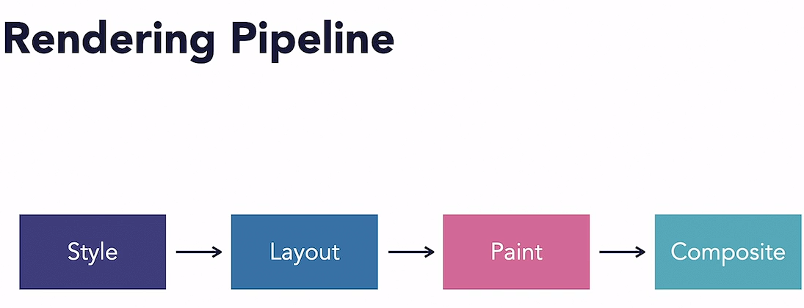
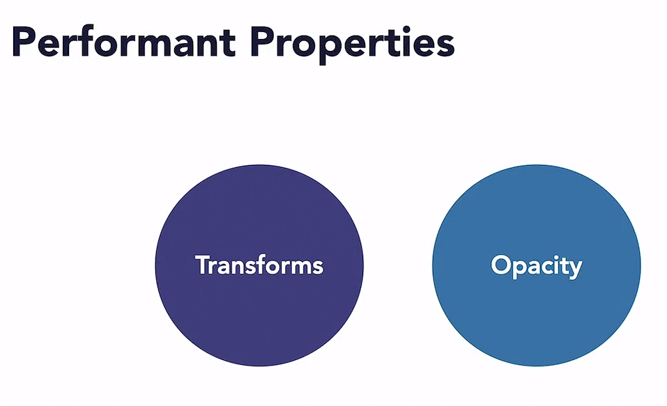
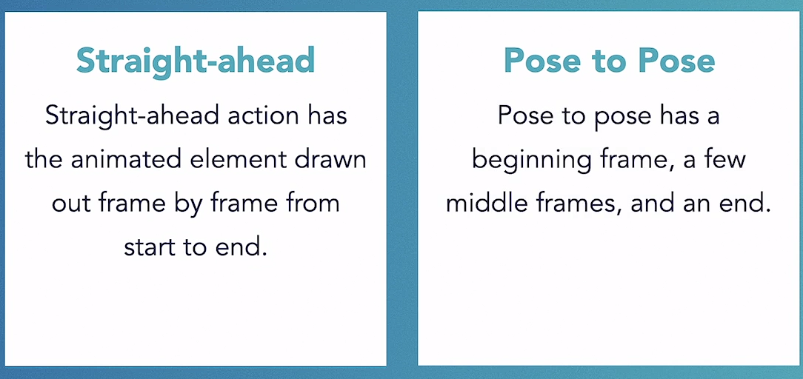
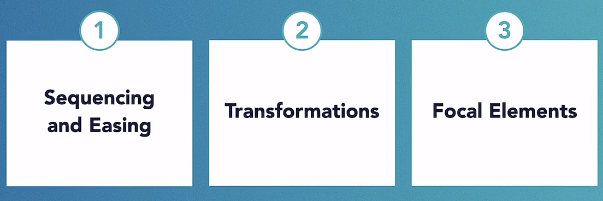
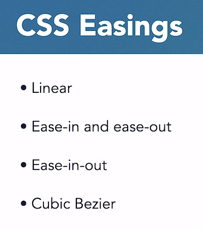
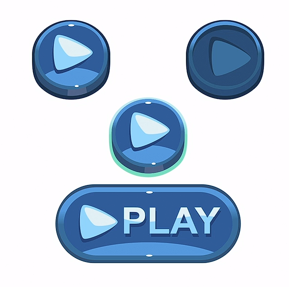
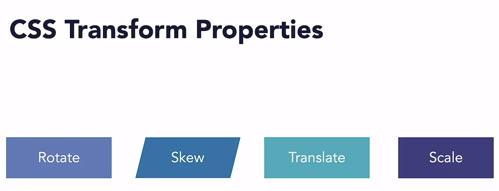
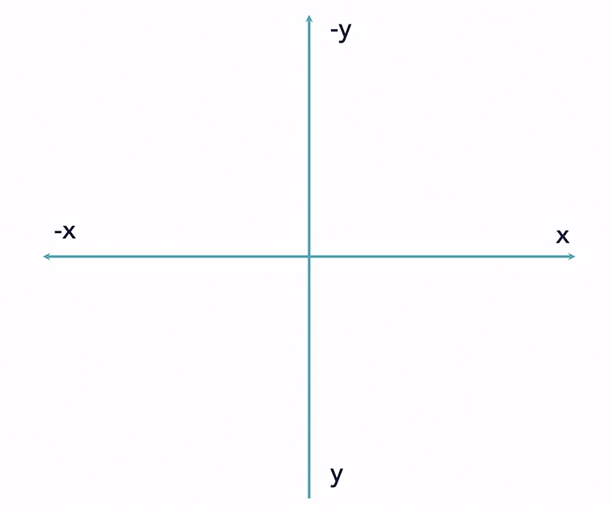

# CSS: Enhancing Interfaces with Animation

## Rendering Pipeline

- Best practice: Only affect the composite layer when animating.

## Performant Properties

### Other properties
- Cause the browser to perform a new layout.
- Cause the browser to perform a new paint.
- Animating other properties will negatively impact performance

## Animation Accessibility
- Some might have vestibule disorder
    - The vestibule system is responsible for sensory information processing and spatial orientation.
    - With this disease people may have balance problems, chronic dizziness, headaches, and nausea when watching animation on web.

### Considerations for Accessibility
1. Size of motion -- Small better
2. Parallax scrolling and scrolljacking
3. Give users control
4. CSS property: prefers-reduced-motion
    - CSS feature used to detect if the user requested the system minimize nonessential motion

## The 12 principles of animation
1. Squash and Stretch
2. Anticipation -- Small actions that lead up to a much larger action
3. Staging
    - Representation of an idea
    - Uses motion to draw attention to what's important
4. Straight-ahead
5. Pose To Pose

6. Follow-Through and Overlapping Action
    - The main mass of an object stops, but the rest continues to move and catch up
7. Slow In and Slow Out
    - Objects don't move in a linear fashion
8. Arc (used often in animations)
    - Object shouldn't move in a straight line; they should move with a little bit of curved motion
9. Secondary Actions
    - Used to support the main action
10. Timing
11. Exaggeration
    - Time to get creative for more fun
12. Solid Drawing and Appeal
    - Work together
    - Solid drawing has to do with 3D space, form, perspective, anatomy, and other aspects of an object.
    - Appeal combines many principles to make an animation appealing and believable

### Benefits of these principles
- Help to create professional animations
- Delight users
- Create complete animation branding

## Animation Choreography

### 1. Sequencing and Easing
- Work together to create good transition choreography.

#### Sequencing
- The order you designate to the various parts of an animation

#### Easing
- Used to help your elements move more naturally.

- Ease-In -- for outgoing elements
- Ease-Out -- for incoming elements
- Ease-in-out -- Start out slow and speeding it up and then slowing it down at the end.
- Cubic-bezier -- To smooth down the start and end of an animation.

### 2. Transformations

Common:

#### Web Axis

Uses:
- Buttons changing on hover
- Mobile menu animation
- Elements scaling on hover

### 3. Focal elements
- A focal element in a transition is a persistent element that is significant to the overall hierarchy of element in transition.

## Code overview
1. [Button](Code/Button/Button.html)
